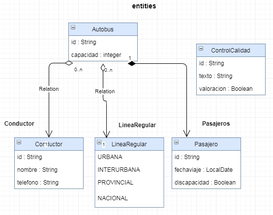
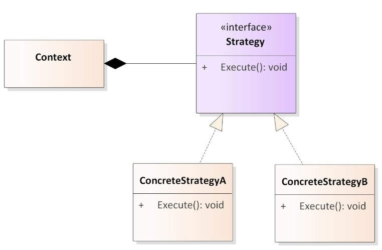

# APAW ECP1 Patrones de Diseño
> Alumno: Torrecilla Sanchez, Agustín
> ##### [Máster en Ingeniería Web por la Universidad Politécnica de Madrid (miw-upm)](http://miw.etsisi.upm.es)
> ##### Asignatura: *Arquitectura y Patrones para Aplicaciones Web - Patrones de Diseño*

### Tecnologías necesarias
* Java
* Maven
* GitHub
* Travis-ci
* Sonarcloud 

### Enunciado
##### Grafico de las entidades y sus relaciones

### Ejercicios
* 1 Factoría con patrón Singleton de la entidad. 
Se almacenan y se buscan las entidades por su id de la 
entidad principal,  como entidad principal se refiere a 
la entidad que posee la relación,  pero la factoría no los crea, 
solo gestiona los objetos.  Debe ir con test de prueba 
Se emplea la entidad ControlCalidad y se realiza su test mediante 
la clase FactoriaControlCalidadSingletonTest 
* 2 Builder de la entidad. Debe ir con test de prueba 
Se utiliza la clase Conductor para su implementación. Test con ConductorBuilderTest. 
* 3 Patrón Composite de la entidad. 
La entidad no puede ser cambiada de su interfaz publico dado. 
Mediante el método view() se visualiza la id si es una entidad y 
name (String) si es una agrupación. Debe ir con test de prueba 
Se realiza a través de la clase Pasajero. Se implementan las clases 
PasajeroComponent, PasajeroComposite y PasajeroLeaf. El test PasajeroTest. 
* 4 Patrón Strategy. 
 Buscar, comprender, explicar y realizar un ejemplo propio de su funcionamiento. 
  
El patrón Strategy pertenece a la clasificación de patrones de comportamiento. 
La utilidad de este patrón es la de permitir que un objeto pueda tener varias operaciones disponibles 
para su elección. Permite diversos comportamientos o estratégias diferenciadas, tantas como estrategias 
diferentes se hayan implementado a partir de una inferfaz común. 
El objeto de forma dinámica establece la estrategia que elija.
Se realiza un ejemplo de implementación a través de diferentes operaciones sobre 2 operandos. 
Suma, resta, hallar la media, el logaritmo, el módulo. Se realiza una clase de Test. 
* 5 A la Factoría anterior, aplicarle el patrón Observer, para que cada vez que se añade un objeto nuevo, 
 provoque un evento. Debe ir con test de prueba. 
 Se emplea la clase ControlCalidad para realizar dicho patrón Observer. 
 Se generan las clases FactoríaObservable y FactoríaObserver. Su test FactoriaObserverTest.